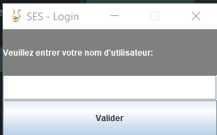
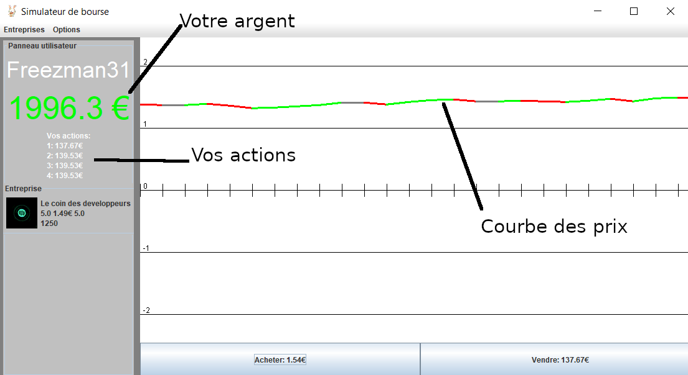
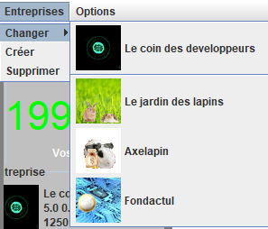
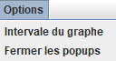

# Stock Exchange Simulation

### Interface

Au lancement du jeu, un nom d'utilisateur vous sera demandé. **ATTENTION !** C'est avec ce nom d'utilisateur que vous pourrez récuperer votre sauvegarde, ne le perdez pas !

--------------------------------------
L'interface de jeu est principalement constituée par un graphe :

Et de deux boutons, le bouton d'achat et de vente
### But du jeu
Le principe est d'avoir le plus d'argent possible en achentant et en vendant des actions (comme un trader !).
Vous devrez pour cela acheter le moins cher possible et de vendre pour un maximum de LapiCoins  !

### Les entreprises / Business

Une grande partie du gameplay de ce jeu : **Les entreprises** !
Les Entreprises sont indÈpendantes et possËdent chacune leurs propres courbes et leurs propres taux.
Les actions ne sont **pas interchangeables** entre les entreprises. Par exemple, si vous possedez une action chez Fondactul, vous ne pouvez *pas* la vendre chez Axelapi !

### Les menus

*C'est quoi une bonne interface sans les bon vieux boutons ??*

#### Les boutons d'entreprises

](https://github.com/Poucy113/StockExchangeSimulation)

Ce menu vous permet de changer d'entreprises et d'en créer / d'en supprimer.
Lors de la création d'une entreprise, il vous sera demandé un nom, une chute maximum (la valeur maximum de la descente de la courbe) et une augmentation maximum (la valeur maximum de la montée de la courbe).

#### Les options

Ce menu-ci vous permet d'adapter les paramètres à votre guise !
Vous pouvez personnaliser l'intervale (l'espacement entre chaque trait de la courbe), ou bien fermer tout les pop-ups
